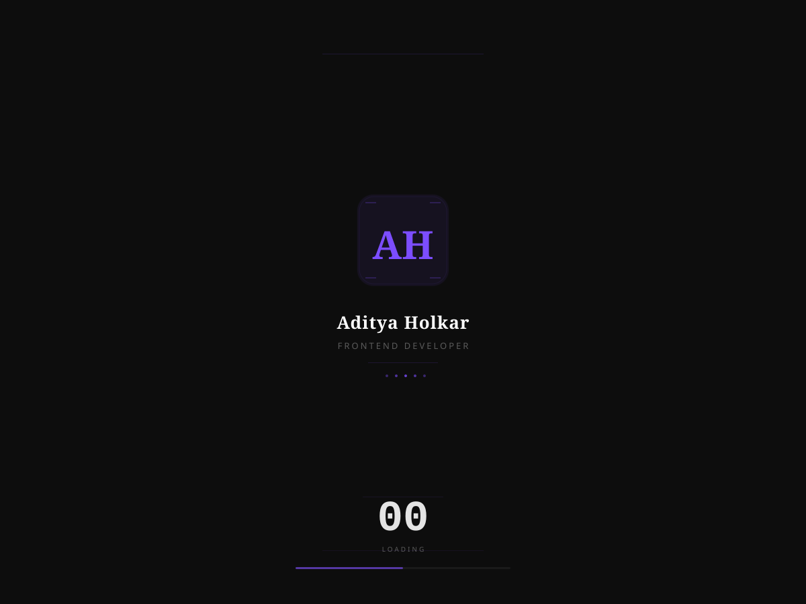

# Shangrila — Personal Portfolio

A personal portfolio website built with React 19, Vite 8, Tailwind CSS v4, and GSAP. Features smooth scroll animations, dark/light theme, and a route-based loading system.

## Tech Stack

| | |
|---|---|
| **Framework** | React 19 + Vite 8 |
| **Routing** | react-router v7 (BrowserRouter) |
| **Styling** | Tailwind CSS v4 |
| **Animation** | GSAP v3 + Lenis v1 |
| **State** | Zustand v5 |
| **Icons** | react-icons v5 |

## Features

- **Splash Screen** — Animated "AH" logo with staggered letter reveal + 0→100 loading counter
- **Route Loader** — Route-aware loading overlay with per-character stagger animation
- **Dark/Light Theme** — Zustand-persisted theme toggle (localStorage)
- **Smooth Scroll** — Lenis-powered smooth scrolling
- **Scroll Animations** — GSAP ScrollTrigger fade-in/slide-up on section enter
- **Scroll Progress Bar** — Fixed top progress indicator
- **Responsive Sidebar** — Desktop sidebar + mobile top bar with hamburger menu
- **Live Clock** — IST time display in sidebar
- **Projects Page** — Dedicated `/projects` route with all project entries

## Sections

| Section | Route | Content |
|---|---|---|
| Hero | `/` | Intro, image, email, Chess.com link |
| Social | `/` | GitHub, LinkedIn, LeetCode links |
| Education | `/` | BSc Comp Sci, Pune |
| Skills | `/` | Tech stack (React, Tailwind, GSAP, etc.) |
| Experience | `/` | Capslock Studio (Frontend Developer) |
| Projects | `/projects` | 7 projects with details & links |

## Screenshots

### Dark Theme (Home)


### Light Theme (Home)


### Projects Page


### Splash Screen



## Getting Started

```bash
# Install dependencies
npm install

# Start dev server
npm run dev

# Build for production
npm run build

# Preview production build
npm run preview

# Lint
npm run lint
```

## Project Structure

```
src/
├── Component/       # React components
│   ├── App.jsx          # Root: Lenis, Navbar, Routes, Splash
│   ├── Home.jsx         # Page composer with ScrollTrigger animations
│   ├── Navbar.jsx       # Sidebar + mobile nav + clock
│   ├── First.jsx        # Hero section
│   ├── Second.jsx       # Social links
│   ├── Third.jsx        # Skills
│   ├── Fourth.jsx       # Experience
│   ├── Fifth.jsx        # Projects (used on /projects route)
│   ├── Sixth.jsx        # Education
│   ├── Footer.jsx       # Global footer
│   ├── Button.jsx       # Reusable styled button
│   ├── Splash.jsx       # Opening animation
│   ├── RouteLoader.jsx  # Route transition loader
│   └── Projects.jsx     # Full projects page
├── Data/             # Shared data files
│   └── ProjectsData.js  # Project entries
├── Zu-Store/         # Zustand store
│   └── Store.js         # Theme + loading state
└── index.css           # Tailwind + CSS vars + theme
```

## Acknowledgments

- Built with [React](https://react.dev) + [Vite](https://vite.dev)
- Animations by [GSAP](https://gsap.com) + [Lenis](https://lenis.darkroom.engineering)
- Styled with [Tailwind CSS](https://tailwindcss.com)
- Icons by [react-icons](https://react-icons.github.io/react-icons)
- Splash counter inspiration from [puntacarretas.com.uy](https://www.puntacarretas.com.uy/)
